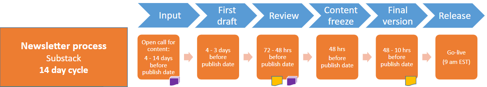

# Emergency Release

If any of PieDAO contracts are exploited putting at risk funds or compromising any process or functionality, the PieDAO Core Team will keep the community updated on the status of the situation, the next steps, the port mortem analysis and next steps.

The following sources will be updated accordingly

1. [Inside the Bakery](https://insidethebakery.substack.com/) Newsletter release
2. [Medium post](https://medium.com/piedao/how-to-mint-pies-gas-free-with-oven-1d11e902fab8)
3. PieDAO [Discord ](http://discord.link/PieDAO)channels

[https://calendar.google.com/calendar/u/0?cid=YWE2YW9xZ21qNDFmYXBpaDNjc2p2MG04ZW9AZ3JvdXAuY2FsZW5kYXIuZ29vZ2xlLmNvbQ](https://calendar.google.com/calendar/u/0?cid=YWE2YW9xZ21qNDFmYXBpaDNjc2p2MG04ZW9AZ3JvdXAuY2FsZW5kYXIuZ29vZ2xlLmNvbQ)

