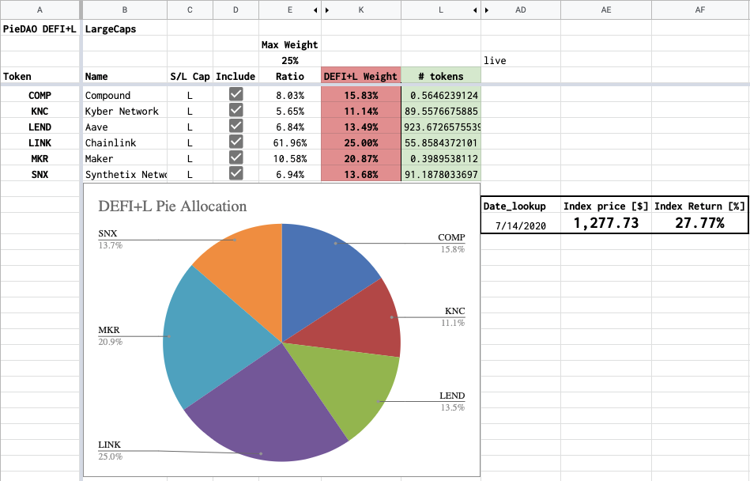

# DEFI+L

## Summary 

Indexes for DEFI Large Cap Pie.

## Motivation 

The DeFi ecosystem is growing in maturity and awareness, the DEFI Pie allows people to get exposure to the ecosystem as a whole with a single token. In order to cope with the current Balancer limit of 8 assets/pool, the suggested approach would include sub-indexes based on assets’ current Market Capitalisation. DEFI+L is the sub-index for the large cap part of the Pie.

## Rationale

Which tokens were included in DEFI+L and DEFI+S were chosen through two rounds of community votes on Discord, this document notarized the choices of the community on-chain. All indexes to be rolled out with SWAP disabled in order to avoid impermanent loss and maximize upside potential. Swap functionality can be enabled by the DAO at will to enable rebalancing. Swap Fees start at 10% to allows a holding strategy with no rebalancing until a certain maximum deviation from the nominal % allocations is reached.

| Ticker | DEFI+L |
| :--- | :--- |
| Assets | COMP / KNC / LEND / LINK / MKR / SNX |
| Max weight per asset | 25% |

