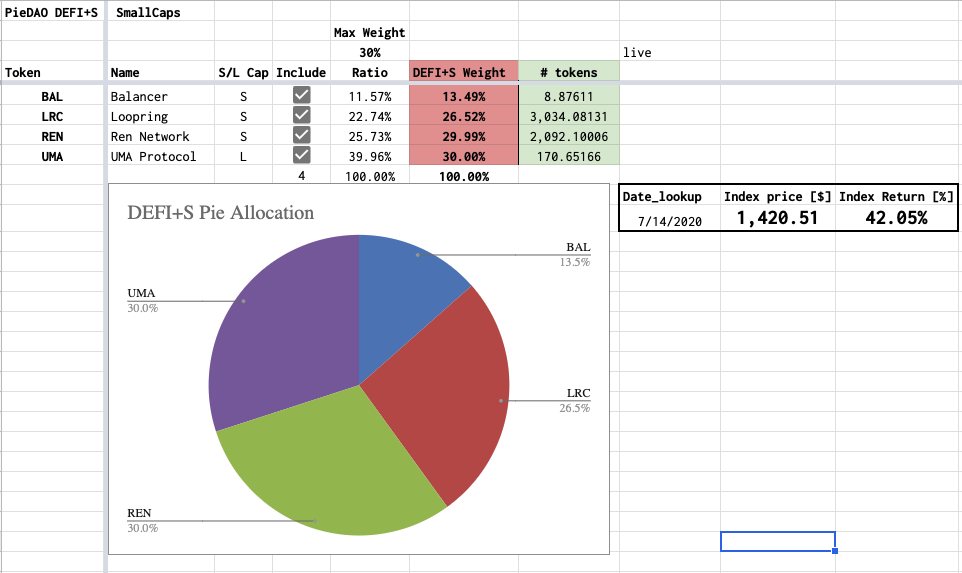

# DEFI+S

## Summary 

Indexes for DEFI Small Cap Pie.

## Motivation 

The DeFi ecosystem is growing in maturity and awareness, the DEFI Pie allows people to get exposure to the ecosystem as a whole with a single token. In order to cope with the current Balancer limit of 8 assets/pool, the suggested approach would include sub-indexes based on assets’ current Market Capitalisation. DEFI+S is the sub-index for the small-cal part of the Pie.

## Rationale

Which tokens were included in DEFI+L and DEFI+S were chosen through two rounds of community votes on Discord, this document notarized the choices of the community on-chain. All indexes to be rolled out with SWAP disabled in order to avoid impermanent loss and maximize upside potential. Swap functionality can be enabled by the DAO at will to enable rebalancing. Swap Fees start at 10% to allows a holding strategy with no rebalancing until a certain maximum deviation from the nominal % allocations is reached.

| Index Allocation |
| :--- |

Assets represented within DEFI+S have been weighted in as a function of their current Market Capitalization, capped by a **max weight of 30%**.

The Index has been initially priced at $1,000, the DEFI+S token has been priced at 1/1000 of the index, one dollar.

Currently, 6 assets have been identified giving exposure to important building blocks of the DeFi ecosystem such as:

* AMMs \($BAL\)
* zkRollup \($LRC\)
* Derivatives \($UMA\)
* Asset Management \($MLN\)
* Interoperability \($REN, $PNT\)

Let’s spend a few words to get to know these projects better!DEFI+S Allocation Live calculation in USD Terms

## UMA — Universal Market Access 

[UMA](https://umaproject.org/) is a protocol for decentralized financial contracts, where everyone can create their own synthetic contracts. The project focuses on the protocol layer and provides unique features such as a “priceless” financial contract, on-chain risk management via liquidations, and a governance system to handle disputes. UMA is flexible and allows for many types of financial derivatives.

To learn more about [UMA Oracle Design](https://docs.umaproject.org/getting-started/oracle) and how [governance](https://docs.umaproject.org/governance/uma-holders) works head over to the [docs](https://docs.umaproject.org/).

UMA accounts for 30% of the Pie, reaching the cap, after a significant upside movement. Most recently, [Coinbase has announced listing the token](https://blog.coinbase.com/uma-uma-is-launching-on-coinbase-pro-d88352e5d818) and new partnerships have been formed, for instance, [with Ren protocol.](https://medium.com/renproject/announcing-the-yield-dollar-with-uma-and-renbtc-859278cce3a2)

## REN Protocol 

[Ren Project](https://renproject.io/) has taken DeFi by storm with the release of the [RenVM](https://renproject.io/renvm), an open protocol providing access to inter-blockchain liquidity for all decentralized applications. RenVM uses a modified version of the Tendermint consensus algorithm designed specifically for sharding and sMPC. The network of machines is composed of “Darknodes”, earning rewards for contributing compute power and storage space.

The project enjoys an impressive number of partnerships including Curve, Loopring, Matcha, and more.

REN accounts for 29.60% of the Pie, almost at cap, after moving $350M+ in volume between chains and with $110M+ of total value locked. The REN token is well available on both CEXes and DEXes.

Most recently, the announced their [Road to Decentralisation plan](https://medium.com/renproject/renvm-and-the-road-to-decentralisation-72213c3bee3a) and the next steps from phase sub-zero.

## Loopring Protocol 

Loopring is a decentralized exchange protocol that allows anyone to build fast, non-custodial, order book-based exchanges.

The project has been iterating since [the original roadmap](https://medium.com/loopring-protocol/loopring-2018-rnd-roadmap-33b423526669) published at the end of 2017. The major release 3.0 of the protocol is focused on bringing much better performance without compromising on security. This happens through the use of [zkRollup](https://docs.ethhub.io/ethereum-roadmap/layer-2-scaling/zk-rollups/)s, a technology for layer 2 scaling with high security \(sometimes called layer 1.5\) and high performance \(faster than Optimistic Rollup and Plasma\) while being however less generalizability then others.

For instance, Loopring supports scalable trading and transfers, but not arbitrary EVM actions.

Right now, Loopring offers a superior experience compared to other dexes and it’s been strategically working with projects to offer L2 farming opportunities inside their dexes.

LRC account for 19.28% of the Pie, the token is available on CEXes and DEXes and it’s \(obviously\) highly liquid on the Loopring exchange as well.

Most recently, they announced version 3.6 which brings exciting features like for instance, direct deposits to L2 addresses, universal blocks, increased capabilities, and faster withdraws.

Learn more [here](https://medium.com/loopring-protocol/loopring-protocol-3-6-features-and-challenges-edcon-presentation-673c6f9e9dd6).

## Balancer Protocol 

[Balancer](https://balancer.finance/) is a generalized AMM that offers greater flexibility compared to predecessors, such as Uniswap, which uses a constant product formula \(x \* y = k\).  
By generalizing the formula to use a constant mean, Balancer enables multidimensional pools with a large number of assets \(up to 8 in V1\), those assets can be any weight as long as it’s greater than 2%. It also created the concept of private pools.

PieDAO has created [the first implementation of a DAO-governed AMM pool](https://docs.piedao.org/papers/piedao-the-asset-allocation-dao#pie-smart-pools) with extra functionality on top of vanilla AMMs pools.

After the launch in May, Balancer has managed to attract significant liquidity, sitting comfortably over $500M through an [aggressive liquidity mining](https://balancer.finance/2020/05/29/balancer-liquidity-mining-begins/) program spread out over 1,500+ pools.

BAL accounts for 14.17% of the Pie, the token is available on CEXs and highly liquid on Balancer itself. Balancer pools are quickly becoming an important building block of DeFi projects such as AAVE, BZX, PERP, and PieDAO itself!

Most recently, they [announced the new Smart Pool Factory](https://twitter.com/BalancerLabs/status/1303029728069156864) for Configurable Rights Pools and the team is working towards the V2 of the protocol!

To learn more head over to the [Docs](https://docs.balancer.finance/) and follow [FollowTheChain](https://twitter.com/FollowTheChain).

## Melon Protocol 

[Melon](https://melonprotocol.com/) is an Ethereum-based protocol for decentralized on-chain asset management. It’s one of the OG projects in Ethereum and one of the first projects to raise money through a token sale.

Melon empowers anyone to set up, manage, and invest in customized on-chain managed investment vehicles.

Despite having a working product and being of the first project leading the charge in [decentralizing governance](https://melonprotocol.com/docs/governance/), the project has been growing slowly but steadily. It currently counts 382 decentralized funds.

One of the reasons Melon didn’t go through exponential growth is the revenue-generating mechanism based on fund creation. This is about to change with [MIP7](https://github.com/melonproject/MIP/issues/7), authored by [Tom Shaughnessy](https://twitter.com/Shaughnessy119), which brings a new Melonomics with a 20bps annual fee on AUM and token issuance drops of 20% per year which might lead to a significant improvement in earnings potential.

MLN accounts for 3.75% of the Pie, the token is available mostly on CEXs and DEXes with growing volume.

Learn more by heading to the [Docs](https://melonprotocol.com/docs/melonomics/).

## pNetwork 

The pTokens system bridges a variety of blockchains, powering the free movement of crypto liquidity. These bridges are operated by a network of validators, whose role is to verify the cross-chain asset switch and to  
guarantee the 1:1 peg with the underlying asset.

While this in phase-1, ultimately the pTokens peg-in and peg-out processes will be granted by a network of TEE operators \(validators\) through the use of Multi-Party Computation. MPC is used to enable the distributed signing  
\(via a threshold signature scheme\) of peg-in and peg-out operations  
among the network of validators.

The system is purposely simple in its design, it uses a standard MPC primitive and multi-TEE setup compared to a custom solution like RenVM or multi-federated pegging mechanism like tBTC.

PNT accounts for 3.25% of the Pie, the token is available mostly on CEXs and DEXes.

Most recently, pNetwork started its journey to decentralization by launching their DAO and announced the liquidity mining program, [called Steroids](https://p.network/steroids), that incentivizes both Uniswap liquidity providing and staking within the pNetwork DAO. Staking the governance token yield up to **42% APR** from the DAO active voting.

Learn more on [the website](https://p.network/governance).

## Minting DEFI+S 

As requested from users, this release includes a 1-tx Zap experience to mint DEFI+S directly from ETH! The classic way of minting by providing all the underlying assets is also available.

The Single Asset entry will automatically source the necessary tokens from UniswapV2 and will return any additional ETH left, no additional fees are charged for that.

The process aims to be more efficient compared to sourcing all the underlying assets manually, approving them, and minting the Pie.

⚠️ **Beware** of the slippage involved while minting a large amount ⚠️

