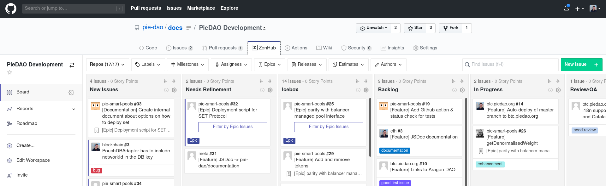

# Development Bounty Program

### Getting Started

Outstanding development issues can be found in the [PieDAO Github Organization](https://github.com/pie-dao). We use Zenhub as a project management tool, so if you'd like to contribute, the first thing you should do is install the [Zenhub browser extension](https://www.zenhub.com/extension). This will cause a new Zenhub tab to be present on our active repositories. 

All issues ready for active development will be listed under the Icebox or Backlog columns. Take a look through these issues to get an idea of what skills we're currently looking for and pick an issue or two that you'd like to take on.

### Requesting a Bounty

Now that you've found the issue\(s\) you'd like to work on, hop into our Discord server and announce yourself in the \#development channel. Let us know how many hours you expect each issue to take and how much $DOUGH you are requesting per hour. The core development team and other active devs in the community will review your proposals and be available to answer any questions you have about scope. Once we've all agreed on the general proposal, a member of the core team will put together a [bounty proposal document](https://cloudflare-ipfs.com/ipfs/QmVzwqhzVNYWob24zC1N1Sk7HCb3KAW9P13HX7WjXqdn2g/Travis%20PieDAO%20Proposal%201.pdf), published on IPFS and a [corresponding governance vote](https://mainnet.aragon.org/?#/piedao/0x109b588a4f2a234e302c722f91fe42c5ab828a32/vote/150/). If this vote passes, you will be added to the Contributors team on Github and the quotes will be attached to each issue.

### Performing the Work

Now that you're working on a issue, please create a [feature branch](https://nvie.com/posts/a-successful-git-branching-model/) and provide frequent commit updates. Once you have started, please also drag your issue from the Backlog column to the In Progress column in Zenhub so we know you have started. Any questions or challenges along the way can be addressed with us in the Discord \#development channel or as comments on the Github issue itself.

### Completing Work

As you finish an issue, please open a pull request and link it to your issue using the Zenhub 'Connect an Issue' button located directly below your pull request once created. Once your PR is approved, please note how many actual hours were spent and the ETH address you would like to receive your $DOUGH at. Another governance vote will be initiated to disburse your tokens.

#### 

