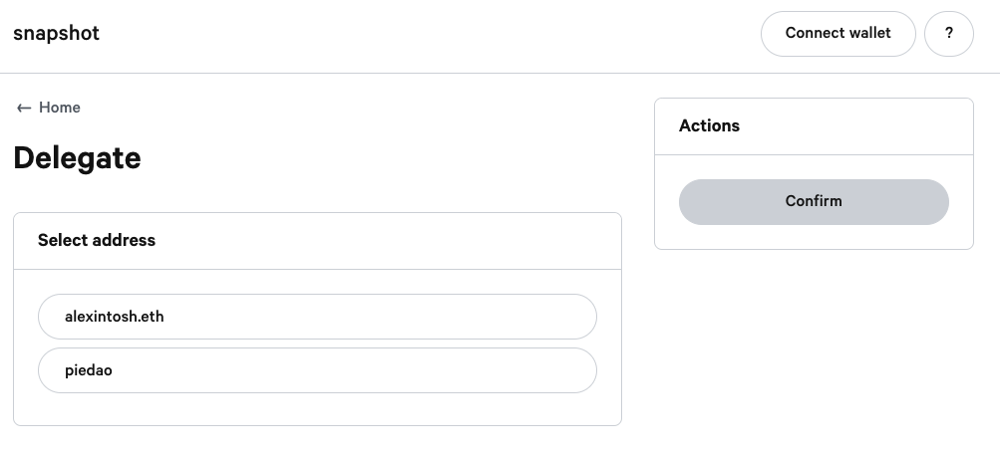

# Snapshot

The Snapshot voting platform can be found at [https://snapshot.page/\#/piedao](https://snapshot.page/#/piedao). Snapshot uses a custom strategy to allow any representation of DOUGH to have the power to vote.  
  
**The voting power of a single user is weighted by the amount of veDough**

You can see the [implementation here](https://github.com/snapshot-labs/snapshot.js/blob/master/src/strategies/piedao/index.ts).

### Delegation

It's possible to delegate your voting power to an address you like, even by using an ENS address!

You can delegate by visiting: [https://snapshot.page/\#/delegate](https://snapshot.page/#/delegate)

