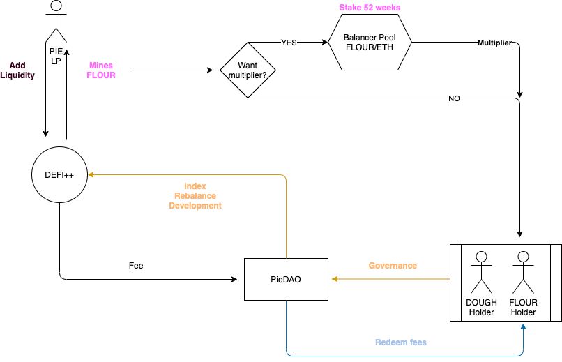

# Pieconomics

## Key Summary 

* DOUGH can do a one-way migration to DOUGHv2 at will, at a rate of 1 DOUGH per 1 DOUGHv2.
* Token requests will be accepted until the date of deployment of DOUGHv2.
* At the time of migration, DOUGHv2 will be vested according to [PIP 12 vesting schedule](pip-11-phase-0-staking-and-delegation.md).
* DOUGHv2 will be used to seed pairs like for instance DEFI++/DOUGHv2.
* DOUGHv2 will entitle for the redemption of streaming fees generated by Pies.
* PieDAO will launch a liquidity mining program in DOUGHv2.
* PieDAO will launch a bounty program in DOUGHv2.

## Introduction 

This proposal is a synthesis of Pieconomics - a path to the migration of DOUGH to DOUGHv2.

DOUGHv2 release acts as a catalyst for growth of the PieDAO ecosystem, Pieconomics introduces a framework that leverages financial incentives and multilevel governance to prioritize the sustainability of PieDAO and minting of Pies.

## DOUGH Token Migration 

The migration to DOUGHv2 marks the first step in transitioning governance to [Phase 0 - Staking and Delegation](pip-11-phase-0-staking-and-delegation.md).

DOUGH will migrate to DOUGHv2 at a rate of 1 DOUGH per 1 DOUGHv2.

To start the migration, DOUGH will be used to vote on the governance vote to deploy the smart contracts responsible for converting DOUGH to DOUGHv2.

## DOUGH Incentives 

PieDAO will be able to create Ecosystem Incentives for supplying liquidity to Pies.

The liquidity mining program rewards liquidity provision of Pies and introduces a multiplier for the long term LPs in the DOUGH/ETH pool.  
  
**How liquidity mining works:**

* LP mint DOUGH by adding liquidity to Pies like DEFI++.
* At the moment of claiming the DOUGH, if the LP voluntarily stakes DOUGH rewards in the DOUGH/ETH pool, rewards are multiplied.

Fees generated by Pies, in the form of Pie tokens \(ie: DEFI++\), are added to the Balancer pool to grow the market until the DAO decides otherwise.  
  
**What are streaming fees?**  
The streaming fees are paid out to the DAO linearly over time based on the entire market cap of the Pie \(ie: 1% of market cap over 1 year\).   
  
The streaming fee is calculated linearly and can be claimed by anyone, anytime by calling the appropriate function in the Pie smart contract.   
  
**Other rewards**

The community may also decide to allocate rewards to applications built on top of the PieDAO ecosystem via the Bounty program. The decision to integrate new incentives will be performed through decentralized governance of DOUGHv2 holders.

## PieDAO Governance

PieDAO will release pie-crust, a module that calculates the voting weight of holders based on the sum of DOUGH and DOUGHv2 both.  
  
`Vote weight = (DOUGH+DOUGHv2)`

## FAQ

#### How to get DOUGHv2? 

You can convert your DOUGH to DOUGHv2 at a 1:1 ratio, otherwise, you can obtain DOUGHv2 by providing liquidity to Pies.

#### When will DOUGHv2 be released?

The release date with the migration tool is expected to be October 03 2020.

#### What is the supply of DOUGH and DOUGHv2 combined?

_Please note those numbers are subject to change._

If the DAO will accept the proposal the combined total supply over time will expand to 100M and distributed as such over the years:

* 60% distributed to Liquidity providers and developers distributed over the years.
* 20% Summoners of the DAO with 3 years vesting.
* ~11% of DOUGH contributors.
* ~9% for future distribution.

Tokens get minted on-demand via DAO governance vote.  
The LPs, bounties, and summoners vesting happen every second.

#### What is DOUGH used for?

DOUGHv2 is the governance token with value accrual from Pies fees.

* Govern [Pies Parameters](https://docs.piedao.org/papers/piedao-the-asset-allocation-dao#parameters-to-govern).
* Value capture via fees of the different pies.
* Fee Vault redemption.
* Staking and delegation \(once deployed by governance, later in time\).

#### Are DOUGH token holders migrating to DOUGHv2 subject to vesting?

Yes, the vesting period is from 1 to 3 years according to  [PIP 12 vesting schedule](pip-11-phase-0-staking-and-delegation.md).

  

