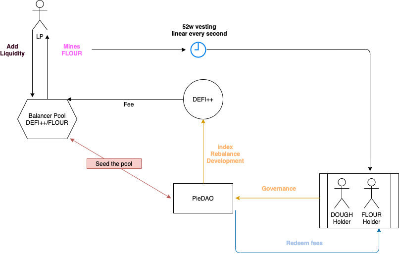

# Pieconomics

## Key Summary 

* DOUGH will migrate to FLOUR, via a Governance vote, at a rate of 1 DOUGH per 1 FLOUR.
* Token requests will be accepted until the date of deployment of FLOUR.
* At the time of migration, FLOUR will be vested according to [PIP 12 vesting schedule](pip-11-phase-0-staking-and-delegation.md).
* FLOUR will be used to seed pairs like DEFI++/FLOUR.
* FLOUR will entitle for the redemption of streaming fees generated by Pies.
* PieDAO will launch a liquidity mining program in FLOUR.
* PieDAO will launch a bounty program in FLOUR.

## Introduction 

This proposal is a synthesis of Pieconomics - a path to the migration of DOUGH to FLOUR.

FLOUR releases acts as a catalyst for growth for the PieDAO ecosystem, Pieconomics introduces a  framework which leveraging financial incentives and multilevel governance to prioritize the sustainability of PieDAO and minting of Pies.

## DOUGH Token Migration 

The migration to FLOUR marks the first step in transitioning governance to [Phase 0 - Staking and Delegation](pip-11-phase-0-staking-and-delegation.md).

DOUGH will migrate to FLOUR at a rate of 1 DOUGH per 1 FLOUR.

To start the migration, DOUGH will be used to vote on the governance vote to deploy the smart contracts responsible for converting DOUGH to FLOUR.

## FLOUR Incentives 

PieDAO will be able to distribute Ecosystem Incentives for supplying liquidity to Pies.  

  
The community may also decide to allocate rewards to applications built on top of the PieDAO ecosystem via the Bounty program. The decision to integrate new incentives will be performed through decentralized governance of FLOUR holders.

## PieDAO Governance

After the deployment of FLOUR, every decision regarding Pies will be performed via FLOUR voting.  
DOUGH will be in control of the DAO Vault.

