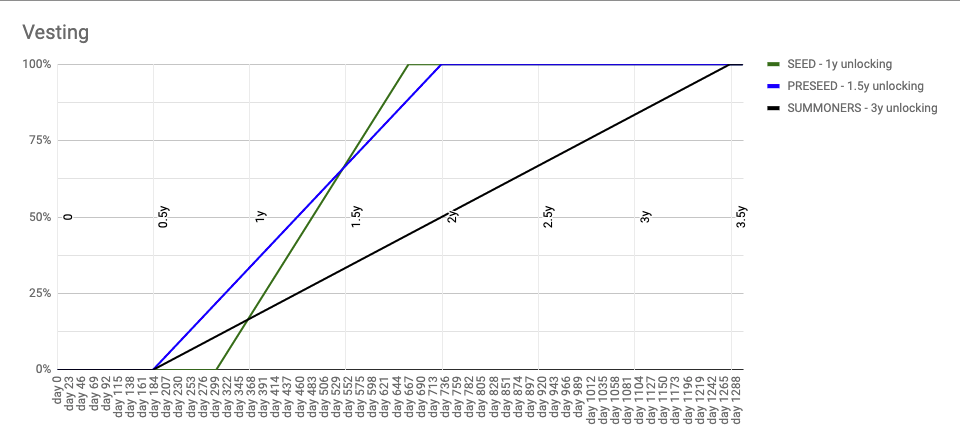

# PIP 12: Phase 0 - Staking and Delegation

## Simple Summary

Proposal for implementing a simplified version of the governance system described in [DAO's Departments with delegated governance](piedao.md) with the introduction of staking and delegation in the governance system, as well as vesting schedule for the unlocking of DOUGHv2.  
  
This proposal purposely excludes elections of Teams and constraints related to having a minimum amount of tokens staked before receiving the delegation.

### Abstract <a id="abstract"></a>

A user will be able to migrate DOUGH for DOUGHv2, stake DOUGHv2 to vote on issues directly, or delegate to another address that can vote on their behalf. DOUGH holders create proposals, DOUGHv2 holder can only vote on them.

### Motivation <a id="motivation"></a>

It's a necessary step to enable delegation in the governance system and prepare the groundwork for the future development of purpose-specific departments inside the DAO.   
  
Delegation works in favor of small holders and users who are not able to vote on every single issue because of high gas prices.

### Specification <a id="specification"></a>

Staking and delegation to be implemented as described in [DAO's Departments with delegated governance](piedao.md), no election system.  
  
Every DOUGH holder is free to burn his token for DOUGHv2 in order to stake them and either self-delegate or delegate to someone else. In opposition to DOUGH which is non-transferable, it will be possible to transfer DOUGHv2, as such a linear unlocking schedule is proposed using as `startDate` the token request timestamp and as seed/preseed notation according to the rates voted in at the time of joining the DAO.



Short epochs to iterate quickly. Proposed time for each epoch: 7 days with `Epoch Reward`targetting 50% for the first year.  
  
Tokens have to be delegated before the current epoch in order to be used to vote \(ie: if currentEpoch = 2, in order to participate they had to be delegated in Epoch 1\). Anybody can participate in governance by receiving delegation, even without owning DOUGHv2 in their wallet.  
  
Users can delegate to 1 address at a time, and the number of votes added to the delegatee’s vote count is equivalent to the balance of DOUGHv2 in the user’s account. Votes are delegated from the current block and onward, until the sender delegates again, or transfers their tokens.  
  
Simplified Example based on the [COMP delegation functions](https://etherscan.io/address/0xc00e94cb662c3520282e6f5717214004a7f26888#code).

```text
/**
 * @notice Delegate votes from `msg.sender` to `delegatee`
 * @param delegatee The address to delegate votes to
 */
 function delegate(address delegatee) public {
  address currentDelegate = delegates[delegator];
  uint96 delegatorBalance = balances[delegator];
  delegates[delegator] = delegatee;
  
  _moveDelegates(currentDelegate, delegatee, delegatorBalance);
}
```

Rewards are calculated and can be claimed at each epoch, once claimed they are escrowed for 26 weeks with an append-only function \( no new vested entries earlier than the last one\). Rewards can only be claimed for a period of 4 epochs once closed, unclaimed rewards will be used for future rewards.  
  
Simplified Example based on the [SNX vesting contract for rewards.](https://etherscan.io/address/0xb671f2210b1f6621a2607ea63e6b2dc3e2464d1f#code)

```text
function appendVestingEntry(address account, uint quantity) public
{
    uint scheduleLength = vestingSchedules[account].length;
    uint time = now + 52 weeks;

    if (scheduleLength == 0) {
        totalEscrowedAccountBalance[account] = quantity;
    } else {
        require(getVestingTime(account, numVestingEntries(account) - 1) < time, "Cannot add new vested entries earlier than the last one");
        totalEscrowedAccountBalance[account] = totalEscrowedAccountBalance[account].add(quantity);
    }
    
    vestingSchedules[account].push([time, quantity]);
}
```

**No penalty policy** during Phase 0, the system starts with indulgence in mind by having all 3 levels of misconduct at 0 and StakerPenalty at 0. Using these parameters means **only rewards and no slashing**. Values can be changed by governance at will if necessary.

**Rationale**

* The first year of DOUGHv2 staking is highly experimental and therefore rewards are high.
* No slashing unless extremely necessary.
* 26 weeks unlocking to immediate liquidation of the rewards.


  


