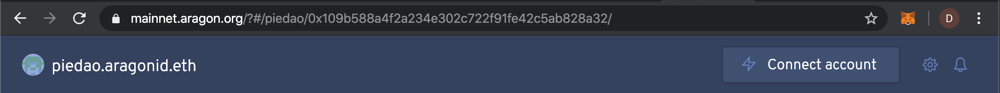
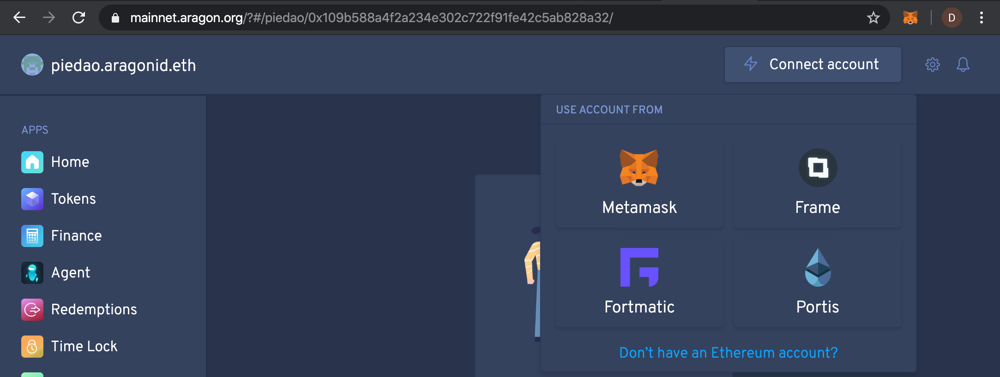
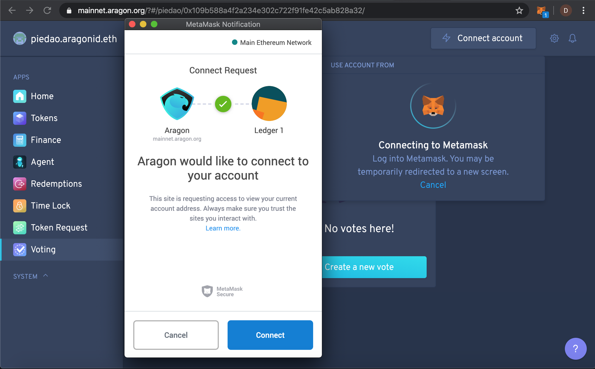
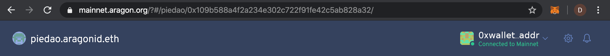

# Connecting Metamask

PieDAO is built on top of Aragon, an incredibly flexible DAO framework. The documentation in this section will describe the basics of how to interact with PieDAO and is generally applicable to most DAOs built on Aragon. All examples will use the most common browser-based wallet, Metamask. If you don't yet have the Metamask browser extension, you can download it at [https://metamask.io/download.html](https://metamask.io/download.html).

To get started, head on over to [http://mainnet.aragon.org?\#/piedao](http://mainnet.aragon.org?#/piedao). In the upper right-hand corner, click the 'Connect account' button.

Select Metamask \(or your preferred wallet\) to continue.

Metamask will pop up a new window asking you to confirm the connection request. Click connect to proceed.


If you don't see the window, it may have spawned behind your browser window. You can click the Metamask fox logo in the upper right-hand corner of your browser to bring the confirmation window to the foreground if it is not visible.


Congratulations! You are now connected to PieDAO and can begin interacting in other ways. You should see a truncated version of your wallet address where the 'Connect account' button was before.

