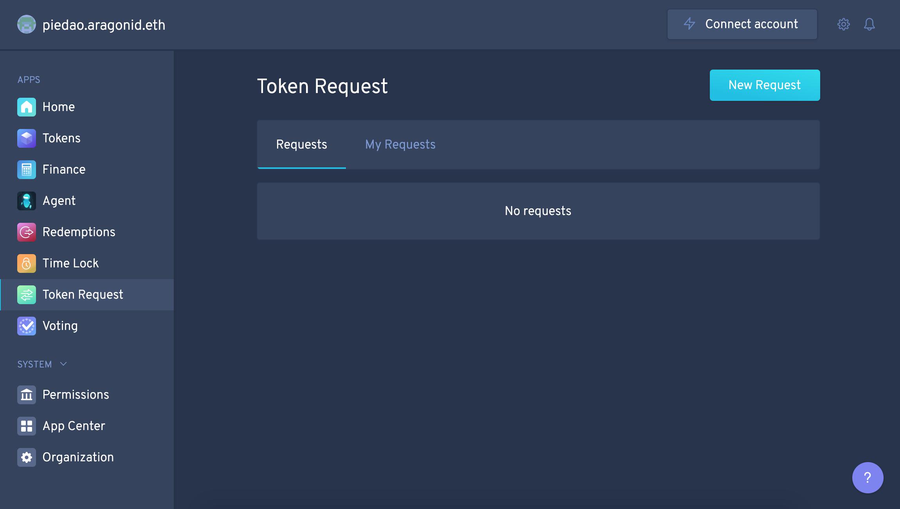
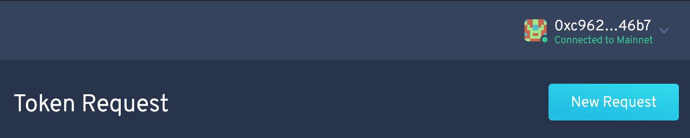
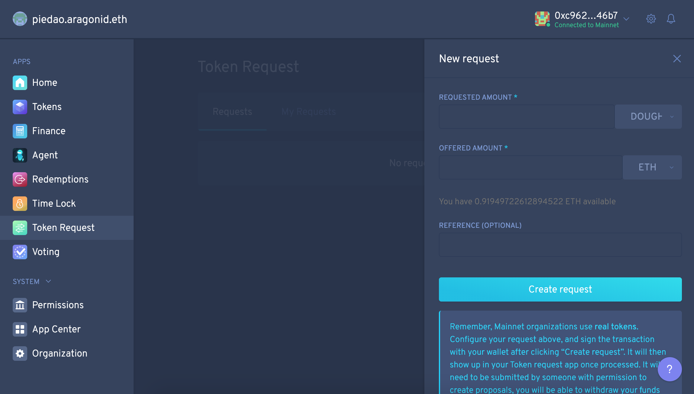
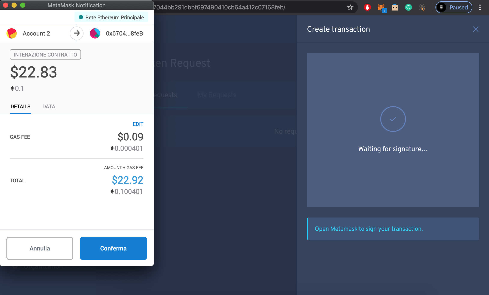
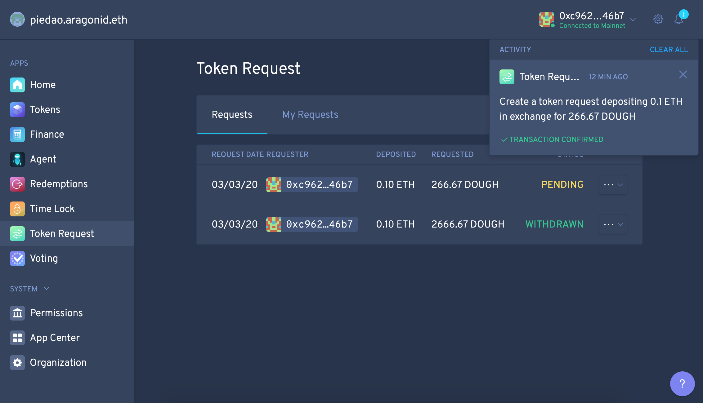

# Joining

## How do I get DOUGH?


The following is adapted from Nicola Di Marco's excellent tutorial, _"How to request DOUGH to participate in PieDAO governance"_, [https://medium.com/piedao/dough-token-request-tutorial-6fdc633994f6](https://medium.com/piedao/dough-token-request-tutorial-6fdc633994f6).


To request DOUGH Tokens, visit the PieDAO Organization Dashboard hosted on Aragon at [https://mainnet.aragon.org/?\#/piedao/0x67044bb291dbbf697490410cb64a412c07168feb](https://mainnet.aragon.org/?#/piedao/0x67044bb291dbbf697490410cb64a412c07168feb).


Before proceeding, ensure that your wallet is connected. You can find detailed instructions on how to do this in the previous section, [Connecting Metamask](https://docs.piedao.org/pie-dao/connecting-metamask).


Click on the 'New Request' button to initiate a new token request.

Fill the New request form with the amount of $DOUGH token you are requesting in exchange for ETH.

The suggested ratio discussed by the DAO at this moment is **1 DOUGH = 0.000375 ETH or 1 ETH = 2666.67 DOUGH**. To make it easier, you can also use this [calculator](https://github.com/pie-dao/docs/raw/master/.gitbook/assets/PieDAO_tokens_calculator.xlsx).

When you're happy with your amounts, click 'Create Request' and sign the resulting transaction.

That's it. When the transaction is confirmed, you have submitted your request. It is now up to the DAO members to initiate a vote and approve or decline the Token Request you just created. 

Once started, a vote takes approximately three days \(72 hours for the vote plus a 12 hour cooldown period\). If your request is approved, your tokens will be minted directly to your wallet.

## What if I've changed my mind?

Have no fear. You can withdraw your request at any time before approval. If you change your mind again, you can resubmit.

## Can I trade it?

No. At the moment, DOUGH is locked in the original purchaser's account and cannot be sold or traded. When Staking is released, DOUGH may be migrated to a new free-floating token.


Make sure to submit your token request from the Ethereum wallet where you intend to hold your tokens. This wallet will be the one through which you can access other PieDAO functions in the future.


## Can I get my ETH back?

Pie DAO's vault backs the DOUGH tokens in circulation. If at any point a member wishes to burn their tokens in exchange for the underlying assets, they can do so through a process called a [Rage Quit](https://docs.piedao.org/pie-dao/rage-quitting).

