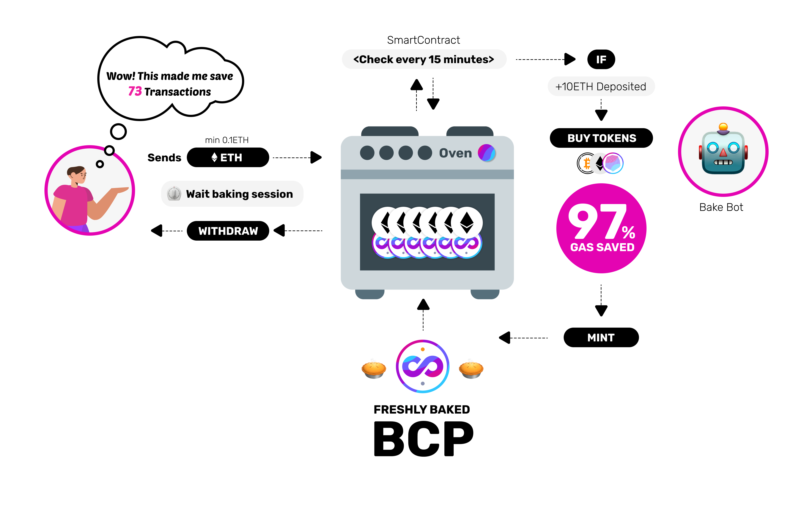

# Oven

Gas prices can be high for minting pies, \(the process of creating new tokens\). AS part of our community's mission to make our products accessible for a global audience and leave nobody behind we created Oven.

Oven is a way to mint new pies without incurring high gas costs, which works by pooling resources together. Many people can mint their pies within the same transaction, sharing the costs between each participant and saving as much as 97% of the cost.

Learn more about Oven.  

