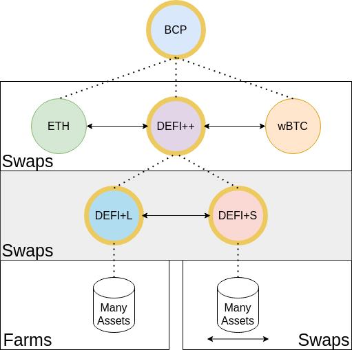

# BCP

### Summary  \| [Link](https://www.piedao.org/#/pie/0xe4f726adc8e89c6a6017f01eada77865db22da14)

| Address | 0xe4f726adc8e89c6a6017f01eada77865db22da14 |
| :--- | :--- |
| Architecture | Smart Pool |
| Streaming Fees | 0.46% _\(Note: contains other pies\)_ |
| AMM | ✅ |
| Equal weights | ✅ |
| Underlying productivity | Only Partial contains DEFI+L |
| Meta-Governance | ❌ |

### Description

  
  
Balanced Crypto Pie is all you need, it provides complete exposure to what our community believes are the core must-own assets in cryptocurrency, an even 33.33% distribution between $BTC, $ETH and DEFI.  
  
The underlying assets in BCP are constantly taking profits and growing your holdings as it automatically rebalances to maintain the set allocation.  
  
**History**

* [Forum post](https://forum.piedao.org/t/pip-32-piedao-balanced-crypto-pie/270)
* [Snapshot Vote](https://snapshot.page/#/piedao/proposal/QmSpBfv7SpyJtUr4qYQRGLvoozkMV7Jf94m99UBTvZA6Du) 

