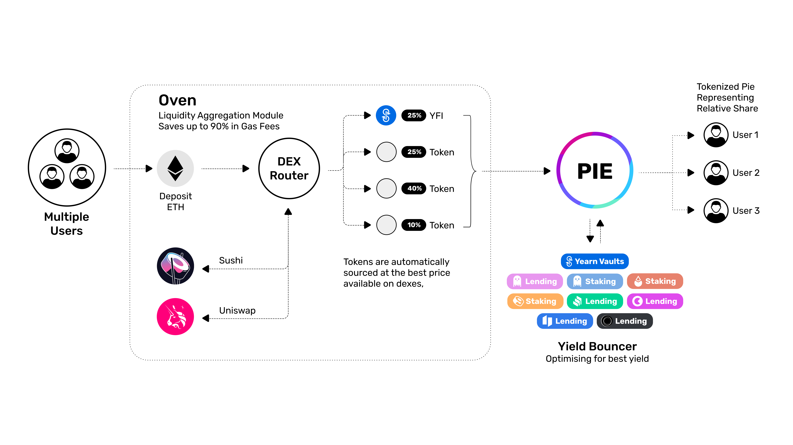

# Oven V2

## **Oven Summary**

The Oven infrastructure manages baking, or pooled entry into a position.&#x20;

The Oven accepts a single token. It uses a recipe, which can combine many steps such as swapping for several assets and depositing them in various strategies or LPs, to compose a single output token.

## EthOven.sol

* constructor
  * \_weth
  * \_outputToken
  * \_roundSize
* receive&#x20;
  * Receives ETH, Deposits to msg.sender\
    \

* depositETH
  * Deposits ETH to message sender\
    \

* depositETHTo
  * Deposits ETH to provided address

## Oven.sol

* Initializes
  * &#x20; inputToken
    * address
  * &#x20; outputToken
    * address
  * &#x20; Recipe
    * address
  * &#x20; roundeSize&#x20;
    * This sets the max units of inputToken to be used per round.&#x20;
    * Acts to limit slippage
  * &#x20; rounds\[]&#x20;
    * Stores each round
  * &#x20; userRounds{}
    * Maps users to rounds&#x20;
  * &#x20; fee
  * &#x20; feeReceive\
    \

* onlyBaker # Modifier
* onlyAdmin # Modifier\
  \

* constructor
  * inputToken
  * outputToken
  * roundSize&#x20;
  * recipe&#x20;
  * Triggers these actions:
    * creates empty rounds
    * Approves tokens
    * Sets default role&#x20;
    * Sets baker role\
      \

* deposit, depositTo, \_depositTo
  * Transfers \`amount\` of \`inputToken\` from \`msg.sender\` to this address
  * Since each \`round\` has a max \`roundSize\` to prevent slippage, deposits loop to fill each round. Break when full \`amount\` assigned to \`rounds\`
* pushUserRound
  * links user to \`roundId\` particularly useful for deposits which span into multiple rounds\
    \

* withdraw, withdrawTo (\`to\`, \`roundsLimit\`)
  * Queries the \`userRounds\` and loops through participated \`rounds\`.&#x20;
  * Calculates the relative share of baked asset the users deposit relates to in both \`inputAmount\` and \`outputAmount\`.
  * transfers \`inputAmount\` and \`outputAmount\` to entered address
  * emits \`Withdraw\` event\
    \

* bake (calldata\_data, memory\_rounds)
  * Can only be called by \`Baker\` role
  * Loops through \`rounds\` and calculates the unbaked amount of round as \`maxInputAmount\`. A fee is applied if applicable.&#x20;
  * \`recipe.bake\` is triggered which bakes \`inputToken\` to \`outputToken\`
  * \`rounds\` are updated with new \`totalBakedInput\`
  * if fee set, transfer to feeReceiver\
    \

* setFee
  * only Admin can invoke\
    \

* setFeeReceiver
  * only admin call invoke\
    \

* roundInputBalanceOf (round, of)
  * returns total input token balance of a user minus baked amount\
    \

* inputBalanceOf (of)
  * sum of \`roundInputBalanaceOf\` for multiple rounds\
    \

* roundOutputBalanceOf (round, of)
  * returns total output balance of a user minus unbaked amount\
    \

* outputBalanceOf (of)
  * sum of \`roundOutputBalanceOf\` for multiple rounds\
    \

* getUserRoundsCount (user)
  * length of rounds per address
* getRoundsCount
  * total rounds length

## Recipe.sol

* Bake
  * A recipe should route from one input token to one output token and the functionality to do so should be triggered by a \`bake\` function.
  * Should accept
    * \_inputToken
      * address
    * \_outputToken
      * address
    * \_maxInput
      * Max input units unbaked for the round
      * If a fee is set, this will have applied.
  * Should return&#x20;
    * inputAmountUsed
      * Defining units of inputToken spent
    * outputAmount
      * Defining units of outputToken produced.
* Any additional function needed to compose the outputToken should be defined in the recipe.&#x20;
* For examples, please see contracts/recipes.
